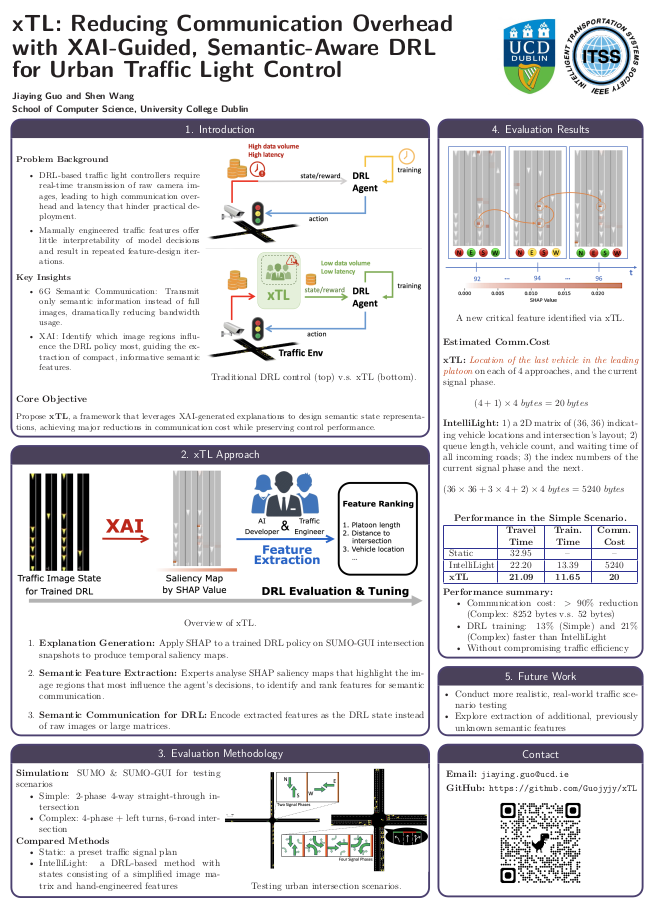

# xTL

> xTL: Reducing Communication Overhead with XAI-Guided, Semantic-Aware DRL for Urban Traffic Light Control


## Table of Contents

1. [Overview](#overview)  
2. [Features](#features)  
3. [Installation](#installation)  
4. [Usage](#usage)  
5. [Configuration](#configuration)  
6. [Scenarios](#scenarios) 
7. [API Reference](#api-reference)  
8. [Contact](#contact)  

---

## Overview

xTL is an open-source framework that leverages eXplainable AI (XAI) to distil lightweight, semantic traffic features from camera images and feed them into a Deep Reinforcement Learning (DRL) agent for traffic light control. By replacing raw image inputs with the _location of the last vehicle in each first approaching platoon_, xTL:

- Reduces communication overhead by **over 90%**, to as little as **20 bytes** per step
- Cuts DRL training time by **up to 21%** compared to IntelliLight
- Maintains or improves traffic efficiency (travel time and delay metrics)

**Tech stack:** Python 3.8+, [SUMO](https://eclipse.dev/sumo/) for traffic simulation, [Ray RLlib](https://docs.ray.io/en/master/rllib/) for DRL, [SHAP](https://github.com/slundberg/shap) for XAI.

## Features

- **Human-in-the-loop XAI guidance**: Generate SHAP saliency maps on a trained DRL policy, then involve AI and traffic-engineering experts to select the most informative traffic features.
- **Semantic communication**: Transmit only distilled features (vehicle‐platoon locations + signal phase), not full camera frames.  
- **Plug-and-play DRL**: Off-the-shelf Proximal Policy Optimisation (PPO) agent with a compact CNN+LSTM architecture.  
- **Reproducible evaluation**: Scripts to run “simple” and “complex” intersection scenarios in SUMO, matching our published experiments.  
- **Extensible**: Easily add new semantic features or swap DRL algorithms.

## Installation

1. **Prerequisites**  
   - Python 3.8 or later  
   - [SUMO](https://eclipse.dev/sumo/) (add `$SUMO_HOME/bin` to your `PATH`)  
   - Git

2. **Clone the repo**  
   ```bash
      git clone https://github.com/Guojyjy/xTL.git
      cd xTL
   ```
   
3.	(Optional) Create a Conda environment (recommended)

    ```bash
      conda create -n xtl python=3.8
      conda activate xtl
    ```

4.	**Install Python dependencies**

    ```bash
      pip install -r requirements.txt
    ```

## Usage

- Train xTL (W/O image for state space) on the complex intersection

    ```bash
      python train.py xTLimage.ini
      python train.py xTL.ini
    ```

- Evaluate a pretrained model on the complex intersection for main traffic metrics (travel time, delay, etc.)

  ```bash
    python evaluation/getResults.py \
      --scen xTLimage_3turnRed3 \
      --avg_num 10 \
      --output-dir output \
      --no_safety # optional, to disable safety checks of time-to-collision
  ```

- Generate SHAP saliency maps from a trained imaged-based DRL model

    ```bash
      python evaluate_SHAP.py xTLimage.ini
    ```


## Configuration

- Environment variables
  - SUMO_HOME: path to your SUMO installation
- Config file
  - `xTLimage.ini`: config file for training and evaluation on imaged-based xTL.
  - `xTL.ini`: config file for training and evaluation on xTL with efficient semantic features，i.e., vehicle‐platoon locations, and current signal phase.
  - `IntelliLight.ini`: config file for training and evaluation on IntelliLight (manually designed traffic features + simplified 2D image input)

## Scenarios

We provide two SUMO scenarios for training and evaluation:

- Simple scenario (`scenario/Junc1_small`): a four-way intersection with two green phases (NS/WE), 90 m road length, about 8 min simulation, 600 veh/h (NS), 180 veh/h (WE), 1 second for a simulation step.
- Complex scenario (`scenario/Junc1_3turn`): a four-way with through & left-turn phases (NS, NS-L, WE, WE-L), nearly 1 hr simulation, 840 veh/h (NS/S), 324 veh/h (WE/E), 5 seconds for a simulation step.

## API Reference

| Module / Script                    | Class / Function                | Description                                                                                                |
|------------------------------------|---------------------------------|------------------------------------------------------------------------------------------------------------|
| **`envs/env_intellilight.py`**     | `IntelliLight(BasicMultiEnv)`   | Defines the traffic environment for IntelliLight.                                                          |
|                                    | `ImageTL3D(IntelliLight)`       | Defines the traffic environment for xTL with image-based features.                                         |
|                                    | `ImageFreeTL(IntelliLight)`     | Defines the traffic environment for xTL with efficient semantic features.                                  |
| **`policies/`**                    | `PolicyConfig`                  | Defines the configuration for DRL policies.                                                                |
|                                    | `CNNModelLSTMSignal(TFModelV2)` | Defines the CNN+LSTM architecture for xTL with image input and concatenated with the current signal phase. |
| **`utils/image_preprocessing.py`** |                                 | Finds the most pertinent traffic imagery around intersections for image input.                             |
| **`train.py`**                     | `main()`                        | CLI entry point to train DRL models.                                                                       |
| **`simulate.py`**                  | `main()`                        | Simulates a non-DRL simulations using SUMO as Static Baseline.                                             |
| **`evaluate_SHAP.py`**             | `main()`                        | Generates and saves SHAP saliency‐map visualisations.                                                      |


## How to Cite

If you use xTL in your research, please cite our paper:

> Jiaying Guo and Shen Wang, “xTL: Reducing Communication Overhead with XAI-Guided, Semantic-Aware DRL for Urban Traffic Light Control,” in *Proceedings of the IEEE Intelligent Vehicles Symposium (IV)*, 2025.

Or in BibTeX format:

```bibtex
@inproceedings{guo2025xtl,
  title={xTL: Reducing Communication Overhead with XAI-Guided, Semantic-Aware DRL for Urban Traffic Light Control},
  author={Guo, Jiaying and Wang, Shen},
  booktitle={2025 IEEE Intelligent Vehicles Symposium (IV)},
  year={2025},
  organization={IEEE}
}
```

## Poster
A high-resolution version of our conference poster is available for viewing and download:
[Download the poster (PDF)](xTL_poster.pdf).

Below is a preview image of the poster:


## Contact
Jiaying Guo (School of Computer Science, University College Dublin)

Email: <jiaying.guo&#64;ucd.ie>

